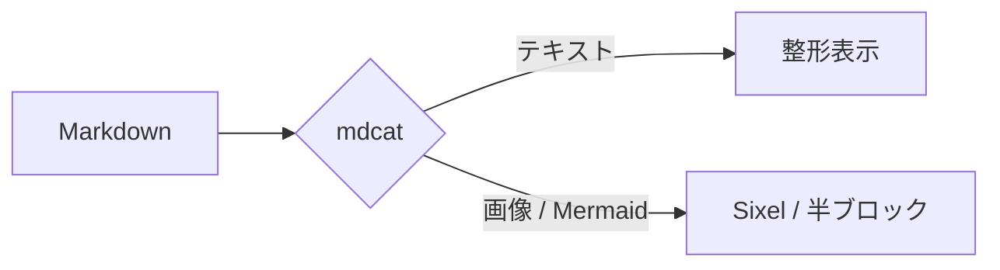
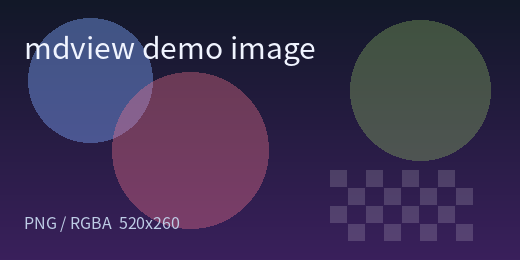

# mdview デモ

テキストは **mdcat** が描画し、図と画像は端末内に描画されます。

## Mermaid


```mermaid
flowchart LR
  A[Markdown] --> B{mdcat}
  B -->|テキスト| C[整形表示]
  B -->|画像 / Mermaid| D[Sixel / 半ブロック]
```

## 画像



## コード

```typescript
export function hello(name: string): string {
  return `こんにちは, ${name}!`;
}
```
